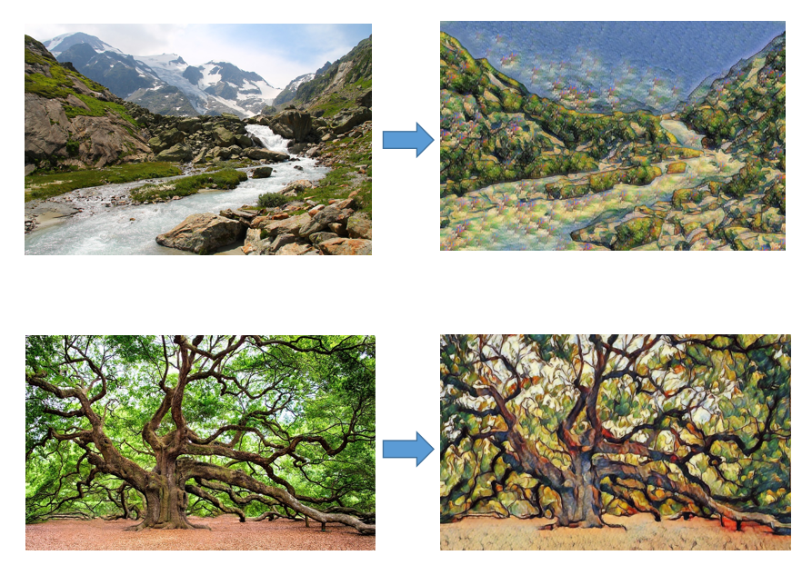

# Edge-Patch-AI-Art
A presentation on how an AI art generator works and how it is built.

It gives the theory, some mathematical formulations and a working example of the AI art generators.

There are two versions of this presentation.

One is for audience with some engineering background.

The other one is for the general public. It was presented at a lunch-and-learn at Trinity Western University back in 2021.
